# Service Tracker

A web application that helps users maintain a digital record of their vehicle maintenance history. Users can store information about their vehicles and track associated service records, providing a centralized solution for managing vehicle maintenance documentation.

## Development Journey

### Motivation
As a former automotive technician, I intimately understood a common problem: the challenge of maintaining accurate vehicle service records. Whether it was forgetting to reset oil change lights, misplacing paper records of service dates and mileage, or needing access to records while away from home, I frequently found myself performing unnecessary maintenance due to poor record keeping. This inefficiency inspired me to create Service Tracker: a centralized digital solution for managing vehicle maintenance records that's accessible from anywhere.

### Technical Learning Goals

#### Authentication & Security
* Building a robust user authentication system with Flask-Login
* Implementing secure password hashing and protected routes
* Managing user sessions effectively

#### Database Architecture
* Designing and implementing entity relationships
* Mastering database migration workflows with Flask-migrate
* Writing complex queries using SQLAlchemy

#### Frontend Development
* Creating mobile-responsive interfaces
* Deepening my experience with TailwindCSS
* Implementing dynamic content updates using JavaScript

#### Clean Code & Architecture
* Applying the Application Factory pattern
* Following MVC principles for clear code organization
* Creating reusable helper functions to maintain DRY principles
* Making purposeful design decisions for team-friendly code

#### API Development
* Designing RESTful endpoints for seamless form population
* Managing CRUD operations across multiple models
* Maintaining effective state management between frontend and backend

### Technical Challenges Overcome

#### Image Processing & Storage
* Implemented image handling using the PILLOW library to convert files to binary data (BLOB) for database storage
* Developed thumbnail generation system to optimize storage space and improve retrieval performance
* Created robust error handling for various image formats and sizes

#### Database Migration Management
* Configured Flask-migrate to handle database schema changes while preserving existing data
* Established reliable build commands for production server deployments
* Implemented version control for database migrations to ensure data integrity

#### State Management
* Designed multiple specialized endpoints (edit, add, display vehicles) to maintain separation of concerns
* Built persistent state management system for form data and modal status across different views
* Implemented efficient data transfer to preserve query results between endpoint transitions

### Key Design Decisions

#### Image Storage Strategy
* Selected BLOB storage with thumbnail optimization for initial implementation
* Prioritized database consistency and data integrity over storage optimization
* Planned future iterations to implement dedicated image storage solution for better scalability

#### Application Architecture
* Adopted the Application Factory pattern to enhance code organization and maintainability
* Implemented clear separation of concerns for better code readability
* Created modular structure to facilitate future feature additions and testing

## End Result & Reflections

### Project Achievements
* Successfully designed and implemented a full-stack web application independently, integrating multiple new technologies
* Created a practical solution for vehicle maintenance tracking that demonstrates significant technical growth
* Developed a scalable architecture that supports future enhancements and feature additions

### Key Learnings
* Prioritize simplicity over complexity in both design and implementation
* Create modular, reusable components and processes from the start
* Plan systematically for both frontend styling and backend logic to maximize code reuse
* Consider scalability and maintainability in early architectural decisions

### Future Development
* Identified opportunities for optimization in image storage and retrieval
* Planned enhancements for user experience and feature set
* Established clear patterns for consistent future development

  
## Demo

### 1. Landing Page
First a user must navigate to the index page and then register an account.

<details>
<summary>View Screenshots</summary>

**Desktop View**  


**Mobile View**  

</details>

### 1.a Registration / Login

<details>
<summary>View Screenshots</summary>

**Desktop View**  
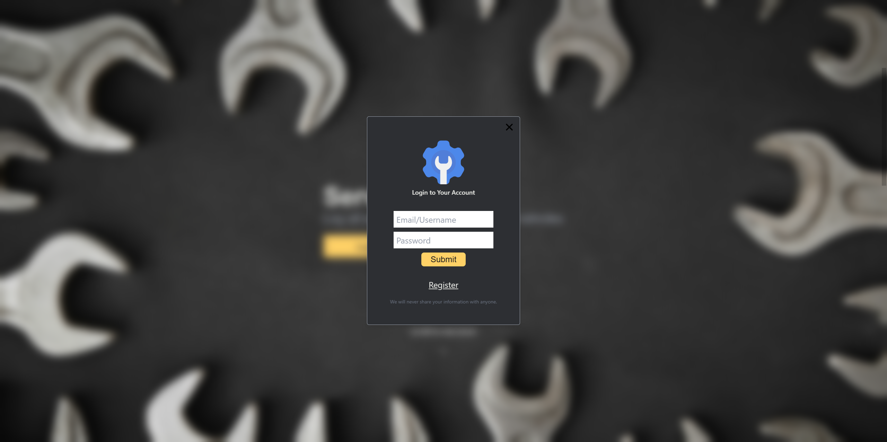

**Mobile View**  
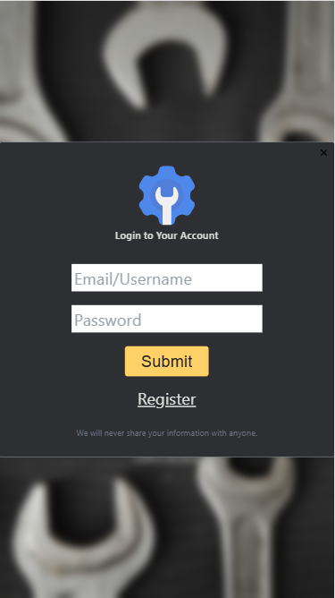
</details>

### 2. Garage Page
After login, users can:
- Add/delete/edit vehicles
- Search by model
- Access vehicle service records

<details>
<summary>View Screenshots</summary>

**Desktop View**  
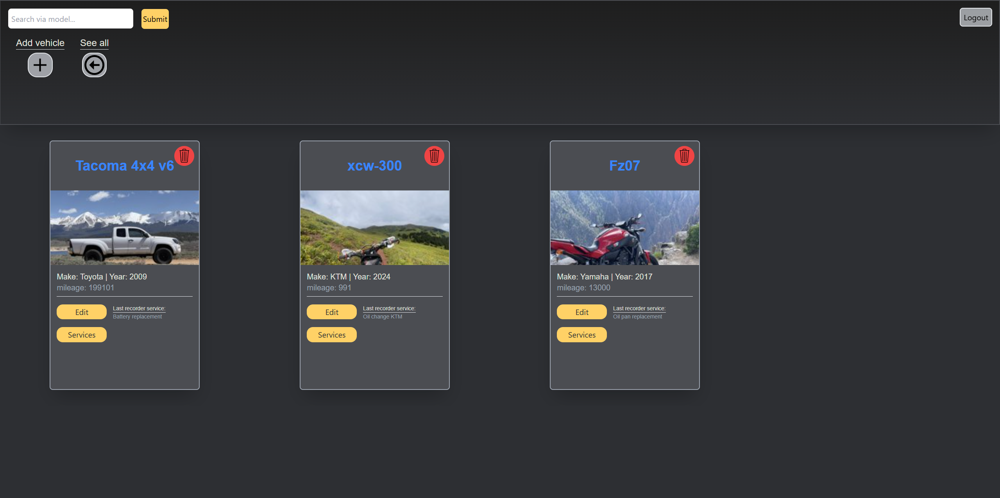

**Mobile View**  
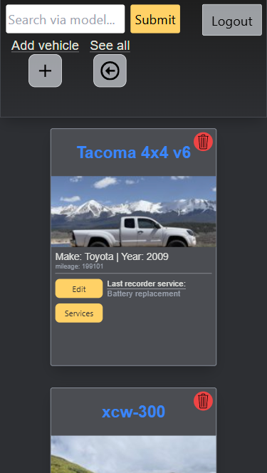
</details>

### 2.a Edit Vehicle

<details>
<summary>View Screenshots</summary>

**Desktop View**  
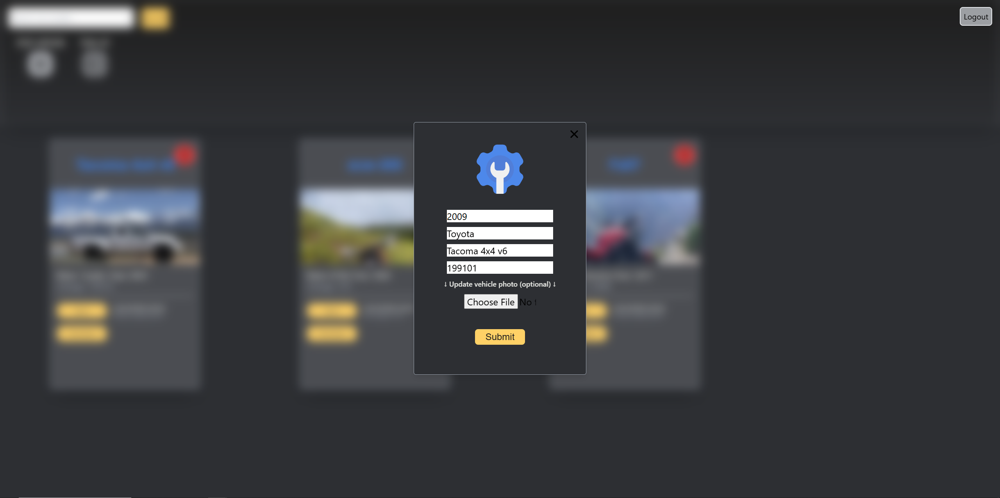

**Mobile View**  
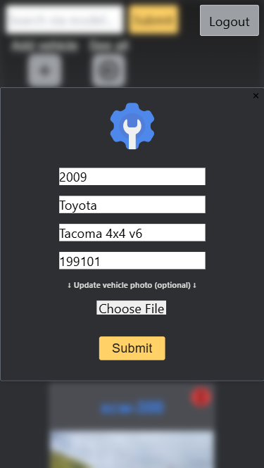
</details>

### 3. Services Page
Users can manage service records:
- Add/delete/edit services
- Search by service title

<details>
<summary>View Screenshots</summary>

**Desktop View**  
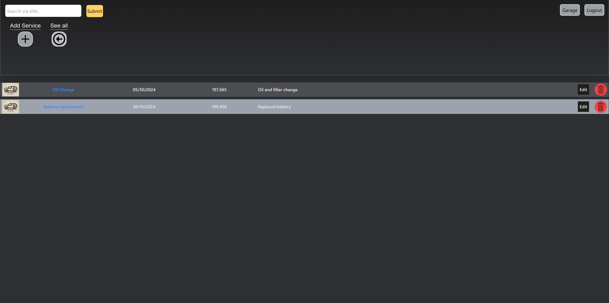

**Mobile View**  
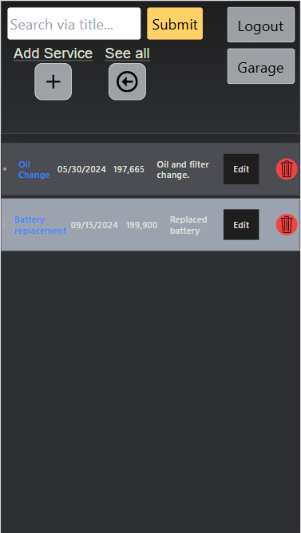
</details>

### 3.a Edit Service

<details>
<summary>View Screenshots</summary>

**Desktop View**  
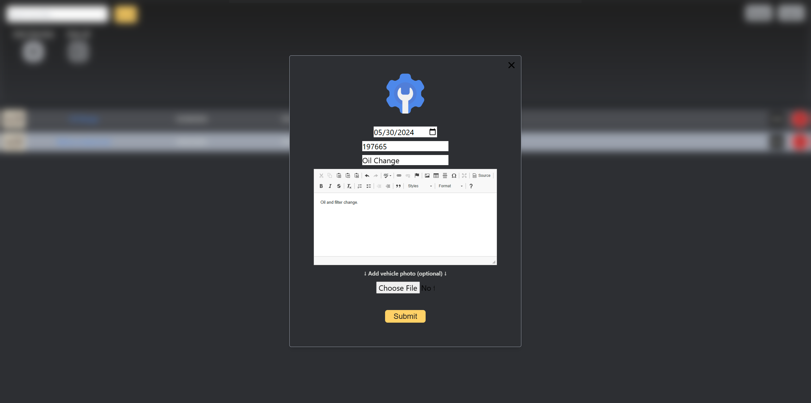

**Mobile View**  
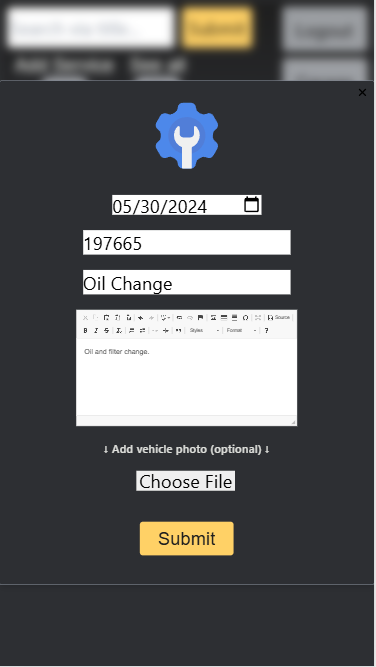
</details>

## Features
- Dynamic form population using RESTful API endpoints - edit forms auto-fill with database records, enabling seamless updates without page reloads
- Advanced search filtering for vehicles and service records
- User authentication with secure password hashing
- Complete vehicle and maintenance record management system
- Image handling with database storage

## Technologies Used
- Frontend: JavaScript, TailwindCSS, Jinja 2 HTML templates
- Backend: Python (Flask, SQLAlchemy, Flask-Login, Flask-migrate)
- Database: SQLite (dev), PostgreSQL (prod) 
- Additional: Pillow for image processing

## Architecture

### Design Patterns
- Application Factory Pattern: App initialization using create_app()
- MVC Architecture: Models (SQLAlchemy), Views (Jinja2 Templates), Controllers (Flask view functions AKA Routes)
- Hybrid Routing: Combination of server-side template rendering and RESTful API endpoints for dynamic updates

### Database Schema
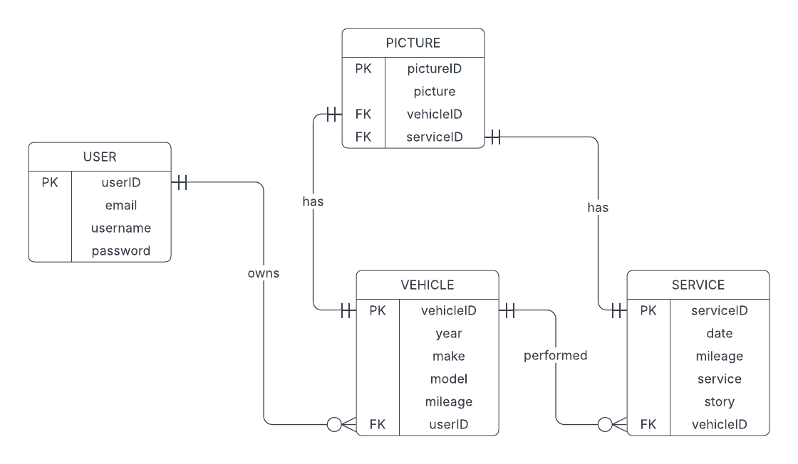

### Application Structure
```
service-tracker/
├── app/
│   ├── static/           # Static assets (CSS, JS, images)
│   ├── templates/        # Jinja2 templates
│   ├── __init__.py      # Application factory and extensions
│   ├── config.py        # Configuration settings
│   ├── extensions.py    # Flask extensions initialization
│   ├── forms.py         # Flask-WTF form classes
│   ├── helpers.py       # Utility functions
│   ├── models.py        # SQLAlchemy database models
│   └── views.py         # View functions and API endpoints
├── migrations/          # Database migrations
├── .gitignore
├── Procfile            # Production deployment config
├── README.txt
├── requirements.txt    # Project dependencies
└── run.py             # Application entry point
```

## Installation
```bash
# Clone repository
git clone https://github.com/yourusername/service-tracker
cd service-tracker

# Create and activate virtual environment
python -m venv venv
source venv/bin/activate  # Linux/Mac
# venv\Scripts\activate   # Windows

# Install dependencies
pip install -r requirements.txt

# Run application
python run.py
```
