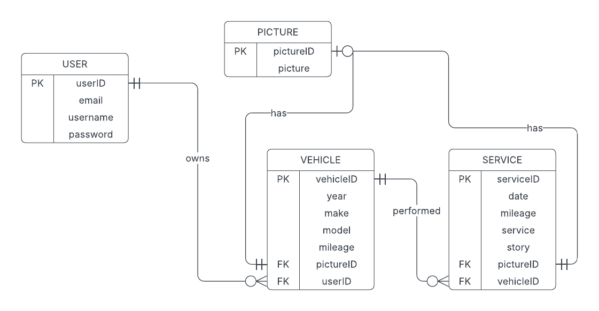

Service Tracker

A web application that helps users maintain a digital record of their vehicle maintenance history.
Users can store information about their vehicles and track associated service records, providing a centralized solution for managing vehicle maintenance documentation.


## Demo

### 1. Landing Page
First a user must navigate to the index page and then register an account.

<details>
<summary>View Screenshots</summary>

**Desktop View**  


**Mobile View**  

</details>

### 2. Registration / Login

<details>
<summary>View Screenshots</summary>

**Desktop View**  


**Mobile View**  

</details>

### 3. Garage Page
After login, users can:
- Add/delete/edit vehicles
- Search by model
- Access vehicle service records

<details>
<summary>View Screenshots</summary>

**Desktop View**  


**Mobile View**  

</details>

### 4. Edit Vehicle

<details>
<summary>View Screenshots</summary>

**Desktop View**  


**Mobile View**  

</details>

### 5. Services Page
Users can manage service records:
- Add/delete/edit services
- Search by service title

<details>
<summary>View Screenshots</summary>

**Desktop View**  


**Mobile View**  

</details>

### 6. Edit Service

<details>
<summary>View Screenshots</summary>

**Desktop View**  


**Mobile View**  

</details>

## Features
- Dynamic form population using RESTful API endpoints - edit forms auto-fill with database records, enabling seamless updates without page reloads
- Advanced search filtering for vehicles and service records
- User authentication with secure password hashing
- Complete vehicle and maintenance record management system
- Image handling with database storage

## Technologies Used
- Frontend: JavaScript, TailwindCSS, Jinja 2 HTML templates
- Backend: Python (Flask, SQLAlchemy, Flask-Login)
- Database: SQLite (dev), PostgreSQL (prod) 
- Additional: Pillow for image processing

## Architecture

### Design Patterns
- Application Factory Pattern: App initialization using create_app()
- MVC Architecture: Models (SQLAlchemy), Views (Jinja2 Templates), Controllers (Flask view functions AKA Routes)
- Hybrid Routing: Combination of server-side template rendering and RESTful API endpoints for dynamic updates

### Database Schema


### Application Structure
```
service-tracker/
├── app/
│   ├── static/           # Static assets (CSS, JS, images)
│   ├── templates/        # Jinja2 templates
│   ├── __init__.py      # Application factory and extensions
│   ├── config.py        # Configuration settings
│   ├── extensions.py    # Flask extensions initialization
│   ├── forms.py         # Flask-WTF form classes
│   ├── helpers.py       # Utility functions
│   ├── models.py        # SQLAlchemy database models
│   └── views.py         # View functions and API endpoints
├── migrations/          # Database migrations
├── .gitignore
├── Procfile            # Production deployment config
├── README.txt
├── requirements.txt    # Project dependencies
└── run.py             # Application entry point
```

## Installation
```bash
# Clone repository
git clone https://github.com/yourusername/service-tracker
cd service-tracker

# Create and activate virtual environment
python -m venv venv
source venv/bin/activate  # Linux/Mac
# venv\Scripts\activate   # Windows

# Install dependencies
pip install -r requirements.txt

# Run application
python run.py
```
